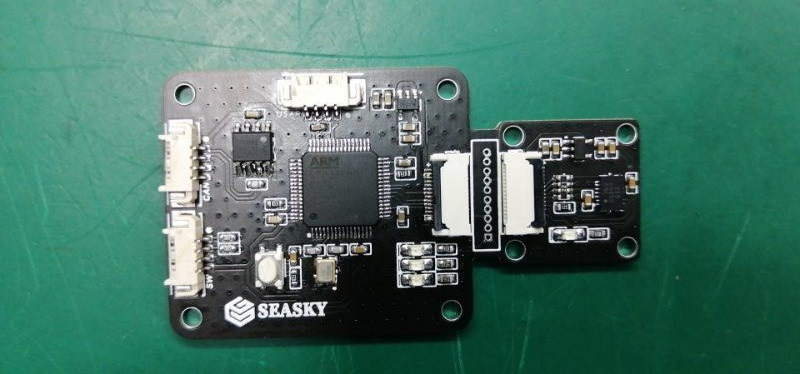
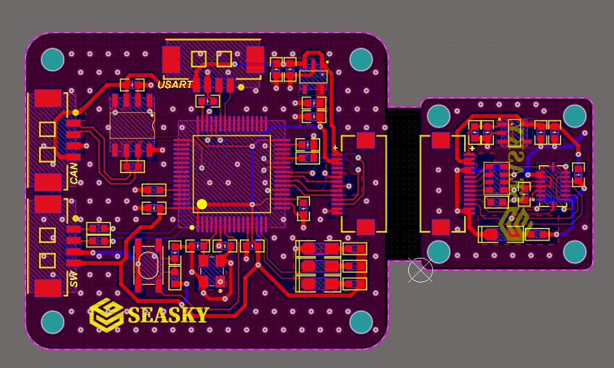
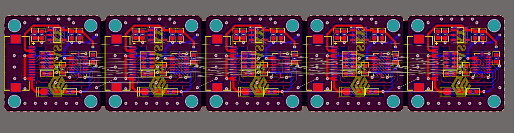
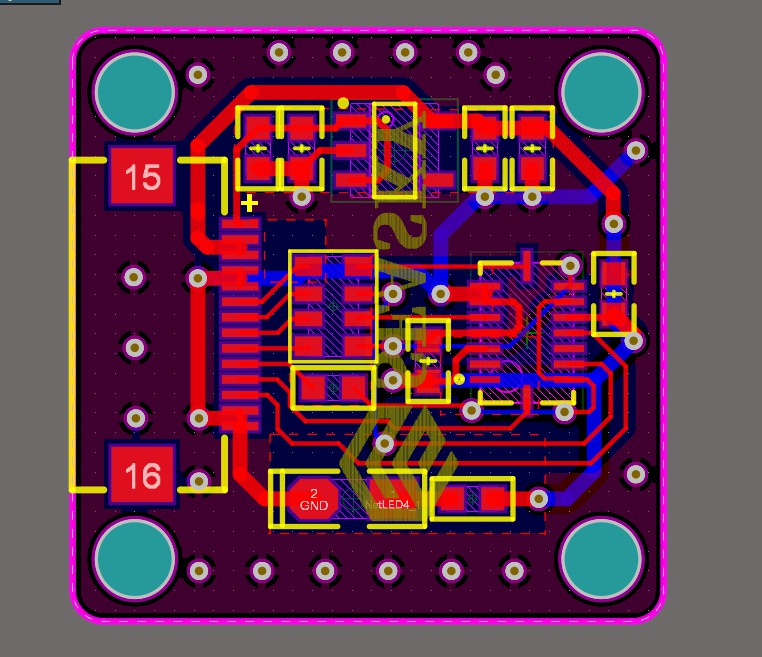
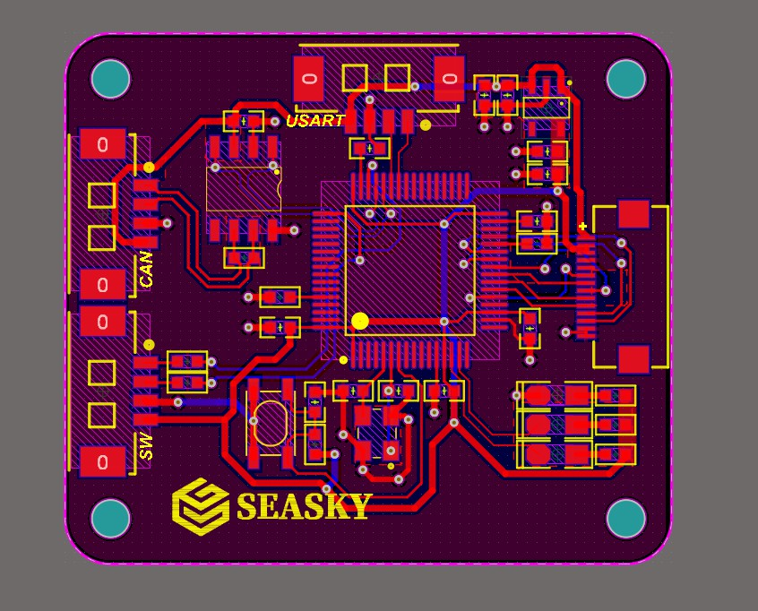

**@版权所有->SEASKY**

开源BMI088姿态传感器
GITHUB:[https://github.com/SEASKY-Master/BMI088_Master](https://github.com/SEASKY-Master/BMI088_Master)

视频[https://b23.tv/BV1Dp4y1C7rC](https://b23.tv/BV1Dp4y1C7rC)
	
	
	
	
	
	
	
说明：
开源包含BMI088的pcb文件和BMI088的pdf原理图文件，以及其他部分参考资料，同时附带了检验程序，仅限于读取bmi088数据，不包含姿态解算。
